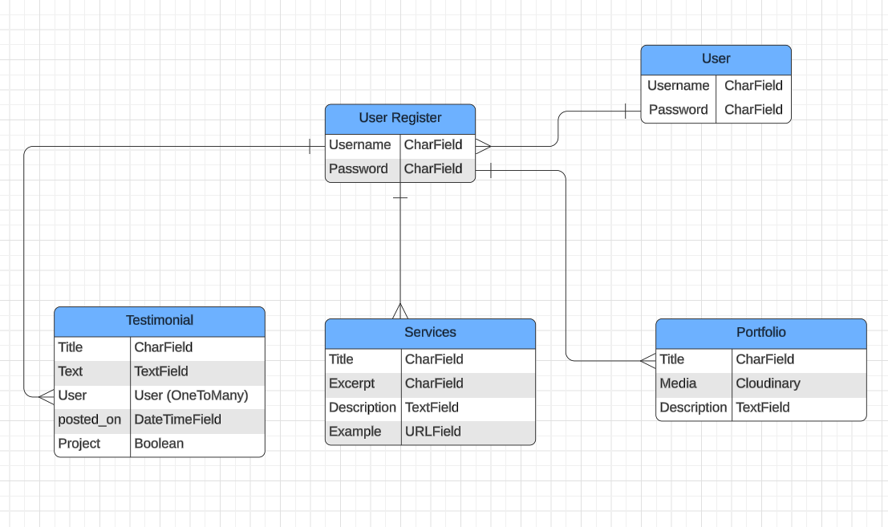
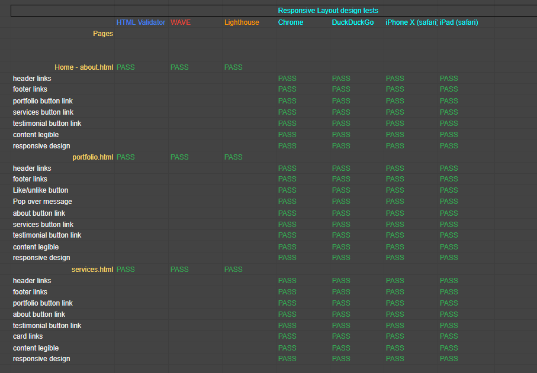
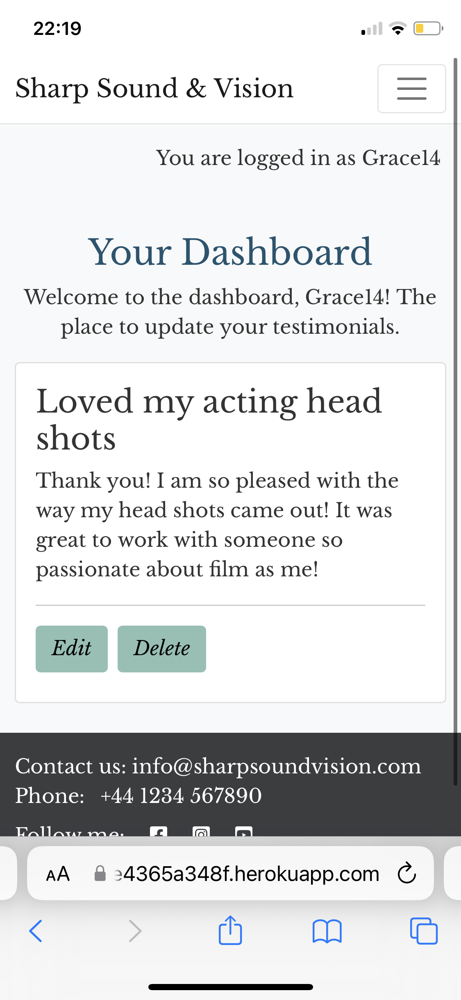
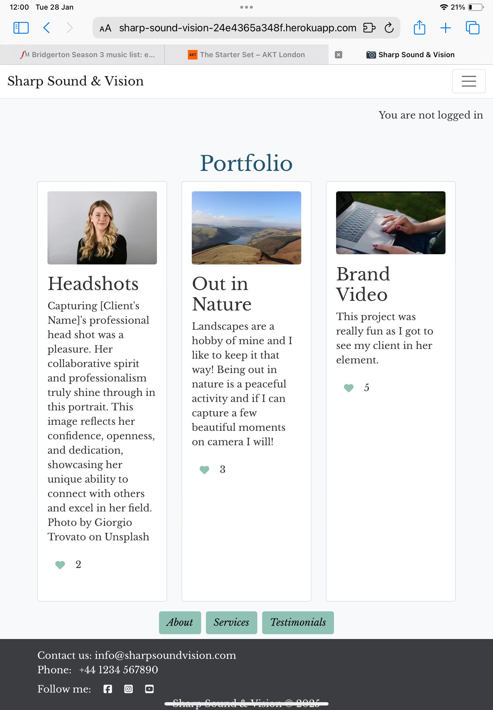

# Sharp Sound & Vision

## Introduction

Sharp Sound & Vision (SS&V) is a web application which displays a portfolio of videography projects to attract clients and collaborators. The concept came about when speaking to a friend who wants to start up a film-making business. Existing platforms like social media and traditional portfolios often lack the cohesive and professional presentation needed to stand out in a competitive market. Therefore the site provides my friend with the ability to showcase her work and the feedback she has recieved from fellow collaborators or clients.

SS&V has been developed as part of the Code Institute's 16 week Full-Stack Developer course as my final individual project - focusing on Django and Bootstrap frameworks, Database manipulation and CRUD functionality.

View live site here : [Sharp Sound & Vision](https://sharp-sound-vision-24e4365a348f.herokuapp.com/)

For Admin access with relevant sign-in information:

## Table of Contents

- [Sharp Sound & Vision](#Sharp-Sound-&-Vision)
  - [Introduction](#introduction)
  - [Table of Contents](#table-of-contents)
  - [Overview](#overview)
- [UX - User Experience](#ux---user-experience)
  - [Design Inspiration](#design-inspiration)
    - [Colour Scheme](#colour-scheme)
    - [Font](#font)
- [Project Planning](#project-planning)
  - [Strategy Plane](#strategy-plane)
    - [Site Goals](#site-goals)
  - [Agile Methodologies - Project Management](#agile-methodologies---project-management)
    - [MoSCoW Prioritization](#moscow-prioritization)
  - [User Stories](#user-stories)
  - [Scope Plane](#scope-plane)
  - [Structural Plane](#structural-plane)
  - [Skeleton \& Surface Planes](#skeleton--surface-planes)
    - [Wireframes](#wireframes)
    - [Database Schema - Entity Relationship Diagram](#database-schema---entity-relationship-diagram)
    - [Security](#security)
- [Features](#features)
  - [User View - Registered/Unregistered](#user-view---registeredunregistered)
  - [CRUD Functionality](#crud-functionality)
  - [Feature Showcase](#feature-showcase)
  - [Future Features](#future-features)
- [Technologies \& Languages Used](#technologies--languages-used)
  - [Libraries \& Frameworks](#libraries--frameworks)
  - [Tools \& Programs](#tools--programs)
  - [AI Usage](#ai-usage)
- [Testing](#testing)
- [Deployment](#deployment)
  - [Connecting to GitHub](#connecting-to-github)
  - [Django Project Setup](#django-project-setup)
  - [Heroku deployment](#heroku-deployment)
  - [Clone project](#clone-project)
  - [Fork Project](#fork-project)
- [Credits](#credits)
  - [Code](#code)
  - [Media](#media)
  - [Acknowledgements](#acknowledgements)

  ## Overview

Sharp Sound & Vision is a web application which displays a portfolio of videography projects to attract clients and collaborators. Users and admin are invited to:

- Create or edit content related to the Services and Portfolio pages.
- Register an account to leave a post on the Testimonials page.
- Discover more about the services provided and about the business.

# UX - User Experience

## Design Inspiration

My friend came up with the name Sharp Sound & Vision for her business and as soon as she told me, I had visions of a clean and slick site which has a professional yet unique feel.

I chose to make a mood-board via Pinterest so I could gather inspiration and visuals. Please find the link here: [Pinterest Board](https://pin.it/3HVshY5Uh)

### Colour Scheme

Driven by the inspiration gathered on Pinterest, I found that a neutral set of colours would work best to achieve both a classy and accessible look to the site. In the explore section of [Adobe Color](https://color.adobe.com/search?q=Neutral%20palette&t=term) I found the Palette of Persia. I also tested these with the Adobe Color Contrast Checker.

*Colour Scheme for Sharp Sound & Vision website*

*Colour Scheme Contrast Checker*

*Colour Blind Test*

### Font

After researching accessible serif fonts I settled on Libre Baskerville by Google Fonts. I did want to use a serif font because it gives the site a classical and professional front.

*Libre Baskerville*

# Project Planning

## Strategy Plane

I was lucky when it came to ideation as my friend had a proposal ready for me: build me a website that I can display my filmmaking portfolio. After discussing the purpose of the site we agreed on the notion that Sharp Sound & Vision will be a visually engaging and user-friendly website which displays a portfolio of videography projects to attract clients and collaborators. Past collaborators will be able to leave testimonials in order for H to grow her clientele. The primary target audience will be potential clientele who require media creation services and creative collaborators.

### Site Goals

- Admin access to create, read, update and delete elements of the ‘Services’, ‘Testimonials’ and ‘Portfolio’ pages.
- Users are able to register and login to leave testimonials on the site.
- Potential clients are able to view the past work of the filmmaker.
- The filmmaker will display their social links and contact information so that collaborators can get in touch.

## Agile Methodologies - Project Management

In order to visualise and manage the workflow of the project I chose to mimic the agile framework of Kanban boards via [GitHub Projects](https://github.com/users/phoebeW17/projects/6). When creating the project board I considered the "To Do," "In Progress," "In Testing," and "Done." phases. This allowed for continuous delivery and task tracking.

### MoSCoW Prioritization

I chose to follow the MoSCoW Prioritization method for SS&V, identifying and labelling my:

- **Must Haves**: the 'required', critical components of the project. Completing my 'Must Haves' helped me to reach the MVP (Minimum Viable Product) for this project early, allowing me to develop the project further than originally planned.

- **Should Haves**: the components that are valuable to the project but not absolutely 'vital' at the MVP stage. The 'Must Haves' must receive priority over the 'Should Haves'.
- **Could Haves**: these are the features that are a 'bonus' to the project, it would be nice to have them in this phase, but only if the most important issues have been completed first and time allows.
- **Won't Haves**: these features won't be implemented in this iteration.

## User Stories

User stories and features recorded and managed via a project board on [GitHub Projects](https://github.com/users/phoebeW17/projects/6)

| User Story | Priority |
|----------------------------------------------------------------------------------------------------------------------------|---------------|
| As a **Site User** I would like to **register an account** so that I can **create on a post.** | **MUST HAVE** |
| As a **potential client**, I want to **read testimonials from previous clients** so that I can **gauge the videographer's reliability and professionalism.** | **MUST HAVE** |
| As the **site administrator**, I want to **update the pages on the site**  so that I can **promote and organise my work.** | **MUST HAVE** |
| As a **site user** I want to **navigate the site to find what section I want to access and explore** so that I can **find out more about the site.** | **MUST HAVE** |
| As a **potential client**, I want to **see the services Sharp S&V offers**, so that I can **see what is most appropriate for my project.** | **SHOULD HAVE** |
| As a **returning client**, I want to **see updates and new projects on the website** so that I can **stay informed about the videographer’s recent work.** | **SHOULD HAVE** |
| As **a site user** I want to **leave my review via a like button** so that **I can give feedback on the portfolio work.**| **SHOULD HAVE** |
| As a **potential client**, I want to **see an about page**, so that I can **know more about the videographer's professional background and approach to projects.**  | **COULD HAVE** |
| As a **site user** I want to **see the social links and contact details clearly** so that **I can connect to the filmmaker.**  | **COULD HAVE** |

## Scope Plane

With a clear and concise purpose which fufilled the requirement of the MVP, I felt that the scope of the project did not have to grow any further. If further features came about they would be added to the Future Features section of this document. My main focus was to keep to the essential features:

- Have a visually engaging website which draws clients in.
- Portfolio page with full CRUD functionality.
- Services page with full CRUD functionality.
- Testimonials page with full CRUD functionality.
- Have a responsive webiste across devices.

## Structural Plane

With a MVP and goals clear, I utilised the Individual Projects Overview excel document created by the CI Class Facilitator team which had a clear timeline and checkpoints which I aimed to hit along the way. I also broke down my daily coding and testing tasks in a planner notebook.

## Skeleton & Surface Planes

### Wireframes

The wireframes for SS&V were created in Balsamiq. It is useful to quickly create wireframes with it's collection of templates for different devices and viewpoints. It was important to think of how I wanted the site to be viewed on tablets and desktops as well as mobiles so Balsamiq was a good tool to use.

**Mobile/Tablet view for:**

- About
- Services
- Portfolio
- Testimonials

    
Mobile About Page Wireframe

    

    
Tablet About Page Wireframe

    

    
Mobile Services Page Wireframe

    

    
Tablet Services Page Wireframe

    

    
Mobile Portfolio Page Wireframe

    

    
Tablet Portfolio Page Wireframe

    

    
Mobile Testimonials Page Wireframe

    

    
Tablet Testimonials Page Wireframe

    

 

**Desktop view for:**

- About
- Services
- Portfolio
- Testimonials

    
Desktop About Page Wireframe

    

    
Desktop Services Page Wireframe

    

    
Desktop Portfolio Page Wireframe

    

    
Desktop Testimonials Page Wireframe

    

### Database Schema - Entity Relationship Diagram

*Database Schema (ERD) for SS&V showing the relationships between features*

### Security

**AllAuth**

I have used Django All Auth for handling the authentication within this project. It has allowed for users of the page to register and sign in to the site to makes the necessary or allowed changes to it.

**Defensive Design**

To ensure a smooth and efficient user experience, I utilised defensive design feautures such as:

- Django messages provide the user with feedback to confirm actions taken e.g. successfully logged out.
- Unregistered viewers of the site are encouraged to sign up should they want to contribute to the site.
- Authentication and the dashboard feature is in place to make sure content is handled by the authors only.
- Deletion of data is confirmed by a delay and a double check occurs.
- Buttons are used to return to previous pages if a click occurs by mistake.

# Features

## Feature Showcase

*For features showcase, screenshots of the features in use were taken on Laptop/iPad Air/iPhone X*

**Navigation bar**

The navigation bar provides the user with links to all the pages they require quickly and users are able to browse via it as well. On medium and smaller screen sizes a burger icon toggle occurs so the links are still visible but not covering the page. The brand name acts as a link to the landing about page.

**Landing About page**

The landing 'About' page provides the user with a welcome to the business. We are met with a portrait of the founder so it is personable and professional. Button links are used to attract the user to explore more pages or directly leave a testimonial.

**Footer**

The footer displays contact, social and copyright details. It is simple and clean and available on all pages.

**Portfolio**

The portfolio is a place for SS&V to showcase their past projects. I have used bootstrap and cloduinary to make these posts uniform but unique. I implemented an orginal like/unlike CRUD feature, inspired from Instagram. This allows logged in users to leave 'kudos' on work they like. A pop over is displayed if the user is not logged in.

**Services**

Services can be updated via the admin panel and are displayed in bootstrap cards, giving a clean and professional look. I would like more visuals to be added in the future.

**Testimonials**

- Users are able to leave a testimonial, they can edit or delete said testimonial via CRUD functionality.

**Register / Login / Log out**

- Users are able to register an account so they are able to leave testimonials and likes. They then log in and log out, notified when they do so.

## Future Features

**News Page**

Admin would be able to upload news about current projects or potential training/workshops people could get involved in.

**Calendar and Booking system**

Users could book a service through a calendar and booking system. This would lead to users having a profile and utilsing the dashboard feature further.

# Technologies & Languages Used

- HTML
- CSS
- JavaScript
- Python
- [Git](https://git-scm.com/) used for version control.
- [Github](https://www.github.com) used for online storage of codebase and the Projects tool.
- VS Code and Gitpod used as a cloud-based IDE for development.
- [Django](https://www.djangoproject.com/) was used as the Python framework for the site.
- [Heroku](https://www.heroku.com) was used to host the SS&V application.
- [Cloudinary](https://cloudinary.com/) was used for cloud media storage of user uploaded images.
- Whitenoise was used for serving static files on Heroku.
- PostgreSQL by CI was used as the Postgres database from Code Institute.
- Bootstrap 5
- Font Awesome
- Favicon

## Libraries & Frameworks

Further information is available in the [requirements.txt file](requirements.txt)

## Tools & Programs

- Adobe Color
- Balsamiq for Wireframes
- Google Fonts
- Pinterest
- Lucidchart for ERD diagram.
- JPG to WEBP Converter: cloudconvert
- Markdown Tables generator: https://www.tablesgenerator.com/markdown_tables

## AI Insights

#### Tools used:

I used Microsoft CoPilot in the browser as well as the chat function and pair programmer in VS Code.

#### Example Uses:

| AI Use                                                            | Example                       | Notes                                                                                                                                                                                                             |
|-------------------------------------------------------------------|-------------------------------|-------------------------------------------------------------------------------------------------------------------------------------------------------------------------------------------------------------------|
| Use AI tools to assist in code creation                           | [link](documentation/images/) | I found this useful as a learner as it added speed to the process, however I was concious to check that it was error free.                                                                                        |
| Use AI tools to assist in debugging code                          | [link](documentation/images/) | Using CoPilot was incredibly useful when it came to defining errors. In some cases it would be a quick fix utilising the inline chat. Other times I asked for definitions of errors which aided my own debugging. |
| Use AI tools to optimize code for performance and user experience |                               | Using Copilot to create code blocks and using the intuitive inline code writer was useful as it was efficient. However it does not automatically write accessible code and usually aria-labels need to be added.  |

#### Reflection on AI Tools:

I found the browser version of CoPilot to be useful as it was unobtrusive towards my code project but did have the drawback of not being able to view the sections of code I am working on. However, for the purpose of trouble-shooting I found this most useful.

I will discuss it's uses in automated testing in the section below.

# Testing

## Code Validation

### HTML

For my HTML files I have used [HTML W3C Validator](https://validator.w3.org) to validate all of my HTML files.

Due to the fact the majority of my pages are developed using Jinja syntax such as '' and '{{ form|crispy }}' and most require user authentication. The HTML validator threw errors when validating via my website's URL so I have had to follow the below approach for most pages:

- Via the deployed Heroku app link, I have navigated to each individual page.
- Right clicking on the screen/CTRL+U/⌘+U on Mac, allows a menu to appear, giving me the option to 'View page source'.
- The complete HTML code for the deployed page will appear, allowing you to select the entire code using CTRL+A/⌘+A on Mac.
- Paste the copied code into the [validate by input](https://validator.w3.org/#validate_by_input) option.
- Check for errors and warnings, fix any issues, revalidate by following the above steps and record the results.

    
HTML pages were checked with no major errors.

    

### CSS

[W3C CSS Validator](https://jigsaw.w3.org/css-validator/) was used to validate my CSS file.

### Python

I have used the PEP8 CI Python Linter to validate the python files in my project.

| File        | Result | Screenshot |
|-------------|--------|------------|
| dashboard   |        |            |
| urls.py     | PASS   | [no errors](documentation/testing/dashboard%20urls.png)           |
| views.py    | PASS   |[no errors](documentation/testing/dashboard%20views.png)            |
|             |        |            |
| portfolio   |        |            |
| admin.py    | PASS   |[no errors](documentation/testing/portfolio%20admin.png)            |
| models.py   | PASS   |[no errors](documentation/testing/portfolio%20models.png)            |
| urls.py     | PASS   |[no errors](documentation/testing/portfolio%20urls.png)            |
| views.py    | PASS   |[no errors](documentation/testing/portfolio%20views.png)            |
|             |        |            |
| services    |        |            |
| admin.py    | PASS   |[no errors](documentation/testing/services%20admin.png)            |
| models.py   | PASS   |[no errors](documentation/testing/services%20models.png)            |
| urls.py     | PASS   |[no errors](documentation/testing/services%20urls.png)            |
| views.py    | PASS   |[no errors](documentation/testing/services%20views.png)            |
|             |        |            |
| testimonial |        |            |
| admin.py    | PASS   |[no errors](documentation/testing/testimonial%20admin.png)            |
| forms.py    | PASS   |[no errors](documentation/testing/testimonial%20forms.png)            |
| models.py   | PASS   |[no errors](documentation/testing/testimonial%20models.png)            |
| urls.py     | PASS   |[no errors](documentation/testing/testimonial%20urls.png)            |
| views.py    | PASS   |[no errors](documentation/testing/testimonial%20views.png)            |

### Browser Compatability & Responsiveness

**iPhone**

**iPad**

**PC**

### WAVE

    
WAVE Accessibility Checks

    

### Lighthouse Audit

    
Lighthouse Audit checks on mobile

    

    
Lighthouse Audit checks on desktop

    

### User Story Testing

| User Story                                                                                                                                             | Achieved | Notes                                                                                |
|--------------------------------------------------------------------------------------------------------------------------------------------------------|----------|--------------------------------------------------------------------------------------|
| As a Site User I would like to register an account so that I can create on a post.                                                                     | Yes      |                                                                                      |
| As a potential client, I want to read testimonials from previous clients so that I can gauge the videographer's reliability and professionalism.       | Yes      |                                                                                      |
| As the site administrator, I want to update the pages on the site so that I can promote and organise my work.                                          | Yes      |                                                                                      |
| As a site user I want to navigate the site to find what section I want to access and explore so that I can find out more about the site.               | Yes      |                                                                                      |
| As a potential client, I want to see the services Sharp S&V offers, so that I can see what is most appropriate for my project.                         | Yes      |                                                                                      |
| As a returning client, I want to see updates and new projects on the website so that I can stay informed about the videographer’s recent work.         | Yes      | A future feature will implement a news page. Updates can be found via the portfolio page. |
| As a site user I want to leave my review via a like button so that I can give feedback on the portfolio work.                                          | Yes      |                                                                                      |
| As a potential client, I want to see an about page, so that I can know more about the videographer's professional background and approach to projects. | Yes      |                                                                                      |
| As a site user I want to see the social links and contact details clearly so that I can connect to the filmmaker.                                      | Yes      |                                                                                      |
|                                                                                                                                                        |          |                                                                                      |

### Automated Unit Tests

# Deployment

The live site can be found deployed on Heroku: [Here](https://sharp-sound-vision-24e4365a348f.herokuapp.com/)

### PostgreSQL Database

This project uses the [CI PostgreSQL Database](https://dbs.ci-dbs.net/)

It was obtained by:

- Logging into the CI LMS platform.
- An email was then sent to me with the link to a new database.

Please note if you are NOT a student with CI you must acquire your own PostgreSQL database if you plan to clone/fork this repository.

### Cloudinary API

This project uses Cloudinary to host our user-uploaded media.
Cloudinary is an API, so an API key is required to connect the Django project securely.

To obtain the key:

- Create an account and log in.
- Copy the API Environment Variable from the Dashboard.
- Remove the CLOUDINARY_URL= in the env.py file so it looks like this:

os.environ.setdefault("CLOUDINARY_URL", " URL copied from Cloudinary in last step ")

## Heroku deployment

This project has been deployed via Heroku, a platform as a service enabling developers to build, run, and operate apps entirely in a cloud based environment.

To start set up an account with Heroku, then:

- Find the Heroku Dashboard and create a new app with your chosen name and region.
- In the app's settings tab, ensure that the Config Var DISABLE_COLLECTSTATIC key has a value of 1. This is only temporary and can be removed before final deployment.
- Other config vars will be added as you set up your project such as: Cloudinary key, Database URL and Secret Key.

Heroku requires these project files in order to deploy:

- requirements.txt
- Procfile
- runtime.txt

Connect your app to your GitHub project in the Deploy tab of the dashboard.

From there you can manually deploy by clicking the 'Deploy Branch' button. Your project should start to build. The build logs can be view in the 'More' menu.

The project should now be connected and deployed to Heroku!

## Clone project

To clone the sharp_sound_vision repository:

1. Find the sharp_sound_vision repository [here](https://github.com/phoebeW17/sharp_sound_vision).
2. Click on the code button, in the clone section select the option you desire to clone the project with. Then copy the URL.
3. Open the terminal in your code editor and change the current working directory to the location you want to use for the cloned directory.
4. Type 'git clone' into the terminal and then paste the link you copied in step 2. Press enter.

## Fork Project

To fork the sharp_sound_vision repository:

1. Log in to Github.
2. Find the sharp_sound_vision repository [here](https://github.com/phoebeW17/sharp_sound_vision).
3. Find the fork button in the right hand corner above the About section.
4. You should now have a copy of the original repository in your own Github.

# Credits & Resources

- Amy Richardson from Code Institute and alumni CI student S. Simpson for the ReadMe structure.

## Code

- Code Institute Learning Materials
- CoPilot
- How to create Instagram Like/Dislike button YouTube tutorial [link](https://www.youtube.com/watch?v=u8zMLHAaDXY)
- How to style bootstrap cards [link](https://www.youtube.com/watch?v=wolSRMGJ-Ls)
- S. Simpson's dashboard feature in their project Lens-Whisperer [link](https://github.com/shar-nm/lens-whisperer/tree/main)
- Django static file management doc [link](https://docs.djangoproject.com/en/4.2/howto/static-files/#deployment)
- Bootstrap popovers doc [link](https://getbootstrap.com/docs/5.3/components/popovers/)

## Media

- Helena Stephens (Main page image)
- Video by: Kaboompics.com from Pexels: [link](https://www.pexels.com/video/hands-woman-laptop-macbook-pro-4393362/)
- Headshot image by Giorgio Trovato on Unsplash
- Peak District landscape by P Whiteley
- Orange flowers by Henry Be (@henry_be)

## Acknowledgements

Amy Richardson from Code Institute for her unwavering positivity and support to myself and the bootcamp SY cohort.

Vasi Pavaloi - Learning Facilitator who did a great job of picking up where Amy left off, thank you for all your help.

Roo Macarthur - Bootcamp Coding Coach, thank you for all your help, you've been brill.

Spencer Barriball - Bootcamp SME, thank you for all your help and wisdom.

The South Yorkshire group - thanks for all the support, what a journey it's been, you're all great!

Helena Sharp-Stephens - thank you my friend for letting your business idea be my guinea-pig project, I hope it is of use to you one day (soon).

To my lovely parents who supported me throughout.
